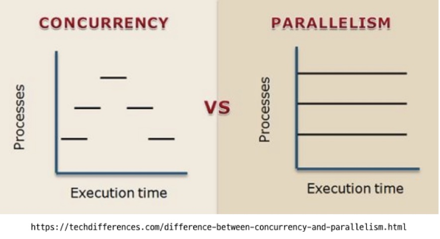

# Thread #1
### 1. 스레드

- 컴퓨터는 다수의 프로그램들이 동작하고 있음, 우리가 작성해서 실행시킨 프로그램은 그 중 하나일 뿐
- 복수의 프로그램이 동작하므로 CPU는 각각의 프로그램을 번갈아가며 실행
- 이때 OS에서 각 프로그램들의 실행 문맥을 기록해두고 각각을 번갈아가며 CPU에 할당하는데 이것을 스레드라고 함
- 즉 OS에서 스케줄링의 단위가 스레드임

### 2. 병행성과 병렬성
- 일반적으로 병행성이 있는 시스템은 병렬성도 가지고 있어서 두 개념이 혼용되기도 함
- 컴퓨터에서는 병행성에 의해 발생하는 이슈들이 있고 이것이 스레드를 이해하는데 매우 중요

  #### 병행성(Concurrency)
  - 한명이 여러가지 일을 번갈아가며 처리하는 것

  #### 병렬성(Parallelism)
  - 동시에 복수의 일을 처리하는 것

<p align="center">
    <a href="https://techdifferences.com/difference-between-concurrency-and-parallelism.html">
        
    </a>
</p> 

### 3. 공유자원과 임계구역
- 컴퓨터에는 복수의 스레드에 의해 공유되는 자원들이 있음
- 한 스레드가 공유 자원에 접근할 때 이것을 임계구역(Critical Section)이라고 함
- 임계구역에 진입할 때는 각별한 주의가 필요
- 우리가 작성한 자바 파일을 컴파일하면 결과로 생성된 .class 파일에는 훨씬 긴 명령들이 적혀있음
- 이것은 우리가 작성한 라인들이 실제 컴퓨터에서는 훨씬 많은 단계로 실행된다는 의미
- 여러 스레드가 동작하는 환경(스케줄링에 의해 여러 스레드가 병행 실행되는 환경)에서는 개발자의 의도와 다르게 동작할 가능성이 큼

### 4. 상호배제 (Mutual Exclusion)
- 임계구역에는 하나의 스레드만 진입 가능해야 하며 이것을 상호배제라고 함
  ##### Runnable로 상호배제를 하지 않고 구현한 예제
    ```java
    public class ThreadExample {
      private static int count = 0;   // 공유 변수

      public static void main(String[] args) throws InterruptedException {
        List<Thread> pool = new ArrayList<>();

        for (int i = 0; i < 10; i++) {  // 10개의 스레드 생성
          Thread t = new Thread(() -> {
            for (int j = 0; j < 10000; j++) {   // 각 스레드마다 1만번 수행
              count++;
            }
          });

          t.start();
          pool.add(t);
        }

        for (Thread t : pool) {
          t.join();
        }

        System.out.println(count);
      }
    }
    ```
  - count가 100,000이 나와야 하지만 결과는 그렇게 되지 않음
  ##### syncronized 구문을 사용하여 해결 (Monitor)
  - syncronized는 자바에서 native로 지원하는 구문이며 메소드에 적용 가능하고 별도의 블록으로도 실행 가능
  - 해당 구문이 적용되면 한개의 스레드만 진입이 가능
  ```java
  public class SyncronizedExample {
    private static int count = 0;

    public static void main(String[] args) throws InterruptedException {
      List<Thread> pool = new ArrayList<>();

      for (int i = 0; i < 10; i++) {
        Thread t = new Thread(() -> {
          for (int j = 0; j < 10000; j++) {
            synchronized (SyncronizedExample.class) {
              count++;
            }
          }
        });

        t.start();
        pool.add(t);
      }

      for (Thread t : pool) {
        t.join();
      }

      System.out.println(count);
    }
  }
  ```
  ##### lock을 사용하여 해결 (Mutex)
  - Mutex(Lock)을 이용해도 같은 결과를 얻을 수 있음
  ```java
  public class LockExample {
    private static int count = 0;

    public static void main(String[] args) {
      List<Thread> pool = new ArrayList<>();
      Lock lock = new ReentrantLock();

      for (int i = 0; i < 10; i++) {
        Thread t = new Thread(() -> {
          for (int j = 0; j < 10000; j++) {
            lock.lock();
            try {
              count++;
            } finally {
              lock.unlock();
            }
          }
        });
            
        t.start();
        pool.add(t);
      }

      for (Thread t : pool) {
        t.join();
      }

      System.out.println(count);
    }
  }
  ```
  ##### Syncronized와 Lock의 차이
  - Syncronized는 Native로 지원되는 기능이고 Lock은 라이브러리로 구현되어 있어 Syncronized가 속도 측면에서 유리하나 그 차이는 크지 않음
  - Syncronized는 무한 대기 같은 상황이 발생 할 수 있으나 Lock은 tryLcok() 메소드를 통해 일정 시간 동안만 대기하거나 하는 등의 유연한 사용이 가능
  - 상황에 맞게 두가지 방식 중 알맞은 방식으로 선택하는 것이 좋음

### 5. Thread의 기타 기능
- Thread.sleep(long timemilli)
  - 일정시간 스레드의 동작을 멈출 때 사용
- currentThread()
  - 현재 실행되는 스레드의 객체를 반환
- getId()
  - 스레드의 ID를 반환
- getName()
  - 스레드의 이름을 반환
  - setName() 메소드를 이용해 변경도 가능
- getPriority()
  - 스레드의 우선순위를 반환
  - 우선순위가 높을수록 자주 실행된다
  - setPriority() 메소드를 이용해 변경 가능
- getState()
  - 스레드의 상태를 반환
- setDaemon()
  - 데몬 스레드는 메인 스레드가 종료되면 같이 종료되는 스레드
  - 만약 A라는 스레드가 작동하고 있는데 join()을 호출하지 않고 메인 스레드가 종료되는 상황이라면 A 스레드는 참조할 방법이 없어 종료를 할 수가 없게 됨
  - setDaemon(true)을 통해 해결할 수 있지만 이것은 권장되는 방법은 아님
  - 스레드는 의도하지 않은 상황에서 종료되는건 바람직하지 않은데 스레드가 작업을 완료하지 않고 종료하게 되면 발생되는 문제점들이 많기 때문일 것임
  - 가급적 사용하지 않고 join()을 해주도록 하자
```java
public class ThreadExample {
    public static void main(String[] args) {
        Thread current = Thread.currentThread();

        long id = current.getId();
        String name = current.getName();
        int priority = current.getPriority();
        Thread.State state = current.getState();

        System.out.println("id: " + id);
        System.out.println("name: " + name);
        System.out.println("priority: " + priority);
        System.out.println("state: " + state);

        current.setName("java thread");
        current.setPriority(Thread.MAX_PRIORITY);
    }
}
```

### 6. Deadlock
- 공유자원이 2개 이상인 경우 (즉 lock이 2개 이상) 문제가 발생할 수 있음
- 예를 들어 1, 2번 공유 자원이 있고 스레드 1이 자원 1을 점유하고 있는 상태에서 자원 2를 얻으려하고
- 스레드 2는 반대로 자원 2를 점유하고 있는 상태에서 자원 1을 얻으려하면
- 두 스레드는 무한 대기 상태에 빠지게 되는데 이것을 데드락이라고 함
```java
public class DeadLock {
    public static final Object lock1 = new Object();
    public static final Object lock2 = new Object();

    public static void main(String[] args) throws InterruptedException {
        Thread t1 = new Thread(new MyThread1());
        Thread t2 = new Thread(new MyThread2());
        t1.start();
        t2.start();
        t1.join();
        t2.join();
    }
}

class MyThread1 implements Runnable {
    @Override
    public void run() {
        synchronized (DeadLock.lock1) {
            try {
                System.out.println("MyThread1 start");
                Thread.sleep(3000);
            } catch (InterruptedException e) {
                throw new RuntimeException(e);
            }
            synchronized (DeadLock.lock2) {
                System.out.println("MyThread1 end");
            }
        }
    }
}

class MyThread2 implements Runnable {
    @Override
    public void run() {
        synchronized (DeadLock.lock2) {
            try {
                System.out.println("MyThread2 start");
                Thread.sleep(3000);
            } catch (InterruptedException e) {
                throw new RuntimeException(e);
            }
            synchronized (DeadLock.lock1) {
                System.out.println("MyThread2 end");
            }
        }
    }
}
```
- 데드락을 완벽하게 막을 수 있는 방법은 없으나
- 설계시 두 자원의 접근을 최대한 격리하여 동시에 접근하지 않도록 주의해야 하고
- Lock 사용시 tryLock() 등을 통해 timoout을 걸어주는 등의 노력이 필요
- 가급적이면 Lock을 동시에 2개를 잡는 행동은 지양하는 것이 좋음
- 직접 스레드를 사용하는 것보다 잘 작성된 라이브러리나 akka 같은 플랫폼을 이용하는 것도 방법