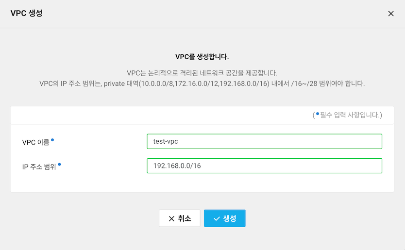
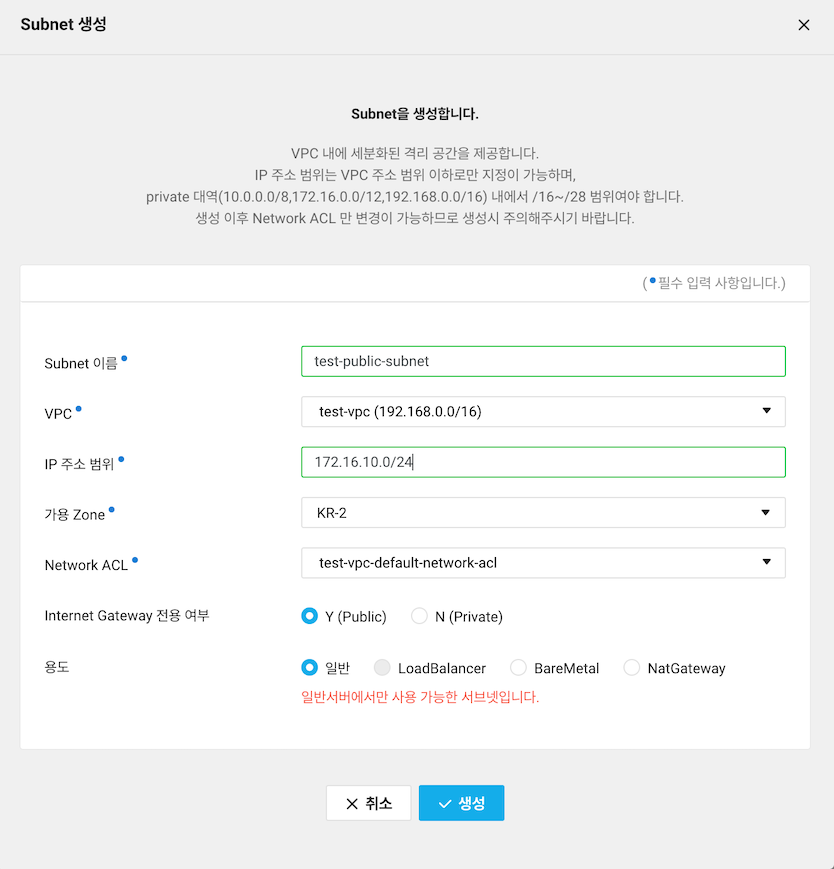
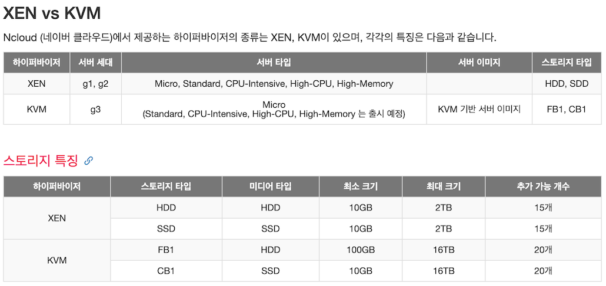

# Naver Cloud Platform
네이버 클라우드 플랫폼 VPC 환경에서 서버를 생성하는 순서 정리

### 1. VPC 설정
- VPC (Virtual Private Cloud) 즉, 클라우드 상에서 논리적으로 격리된 고객 전용 네트워크 공간을 먼저 생성하고 해당 공간에 서버를 생성
- VPC는 고객의 계정마다 최대 3개를 생성할 수 있으며, 각 VPC는 최대 넷마스크 0.0.255.255/16 (IP 65,536개) 크기의 네트워크 주소 공간을 제공

#### VPC 생성
1. Services -> Networking -> VPC -> VPC 생성 버튼 클릭
2. VPC 생성 화면에서 `VPC 이름`과 `주소 범위` 입력

    

 

#### Subnet 생성
1. VPC -> Subnet Management -> Subnet 생성 버튼 클릭
2. `Subnet 이름`을 적절하게 입력하고, 위에서 생성했던 `VPC`를 선택하고, Subnet에서 사용할 `IP 주소 범위`를 입력
   `Internet Gateway 전용여부`는 외부와 인터넷 연결이 필요할 경우에는 `Public`, 내부 서버끼리만 통신할 경우에는 `Private`을 선택
   `용도`는 일반 서버일 경우에는 `일반`을 선택

    

 

### 2. 서버 생성
1. Services -> Compute -> Server -> Server 생성 버튼 클릭
2. 서버 생성 콘솔 선택
   - 기존 콘솔 화면: XEN, RHV 하이퍼바이저 기반의 서버(g1,g2)를 생성할 수 있음
   - 신규 콘솔 화면: XEN, RHV 하이퍼바이저 기반의 서버(g1,g2)뿐만 아니라 KVM 기반 및 다양한 성능을 제공하는 기본 스토리지로 서버(g3)를 생성할 수 있음
3. 서버 이미지 선택
   - 하이퍼바이저 두 타입 중 XEN으로 진행
   

    
   
 
4. 먼저 생성한 VPC와 Subnet 선택
5. 서버 스펙은 `High-CPU`, `CPU-Intensive`, `Standard`, `High-Memory` 등의 타입 중에서 원하는 타입을 선택하고, 각 타입별로 서비스에 적절한 vCPU와 메모리를 선택
6. 요금제는 `월요금제`와 `시간 요금제` 중에서 선택하고, 한번에 생성할 서버 개수와 서버 이름을 입력
7. Network Interface 사설 IP 할당은 자동 할당과 수동 할당 방법 중에서 선택
8. 공인 IP 할당은 Public Subnet을 선택했고 서버에 공인 IP가 필요할 경우에는 `새로운 공인 IP 할당`을 선택
9. 물리 배치 그룹 설정은 서버들을 하나의 그룹으로 묶어서 해당 그룹에 속한 서버들을 클러스터에 배치할 때 어떻게 할 것인지 결정할 수 있음
10. 반납 보호를 설정하면 실수로 서버를 반납하여, 서버가 삭제되는 사고를 방지할 수 있음
11. 스크립트 설정은 서버가 켜질 때 자동으로 실행되어야 하는 스크립트가 있다면 `Server` -> `Init Script` 메뉴에서 미리 스크립트를 등록한 후에 적용할 수 있음

### 3. 인증키 설정
인증키 이름을 입력하고, `인증키 생성 및 저장` 버튼을 클릭해서 인증키를 로컬 PC에 다운로드 받아서 안전한 곳에 보관해야 한다.
기존에 사용하고 있던 인증키가 있을 경우에는 `보유하고 있는 인증키 이용`을 선택

### 4. 네트워크 접근 설정
네트워크 접근은 `ACG`로 설정하게 되는데, `ACG(Access Control Group)`는 서버 간 네트워크 접근 제어 및 관리를 할 수 있는 IP/Port 기반 필터링 방화벽 서비스로, 서버에 별도의 복잡한 방화벽 구축없이 간단하게 서버에 대한 네트워크 접근 제어를 할 수 있다.
`VPC`를 생성하면 자동으로 생성되는 기본 ACG를 선택하거나 별도로 생성한 ACG가 있을 경우 해당 ACG를 선택하면 된다. 적용할 ACG는 최대 3개까지 선택할 수 있음

### 5. 서버 접속
1. 먼저 방화벽 설정을 해야 하는데 테스트로 생성했던 서버를 선택하고 ACG 수정을 클릭하여 적용된 ACG를 확인
2. SSH 접속을 하기 위해서는 22번 포트가 열려 있어야 하므로 `인바운드 규칙`에서 `22번 포트`가 없다면 추가
3. 관리자 비밀번호 확인
   1. 서버 접속에 필요한 관리자 비밀번호를 확인하려면, 서버를 선택하고 `서버 관리 및 설정 변경` 메뉴에서 `관리자 비밀번호 확인` 메뉴를 선택
   2. 위에서 저장했던 pem 파일을 불러오기
   3. 비밀번호 확인을 클릭하면 관리자 비밀번호를 확인할 수 있음
4. 서버 정보 화면에서 `공인 IP 주소` 복사 (SSL VPN 등을 사용할 경우에는 사설 IP 주소 사용)
5. 터미널 -> 셸 -> 새로운 원격 연결 -> 공인 IP 주소 붙여넣기 -> 연결
6. 위에서 확인했던 관리자 비밀번호 입력